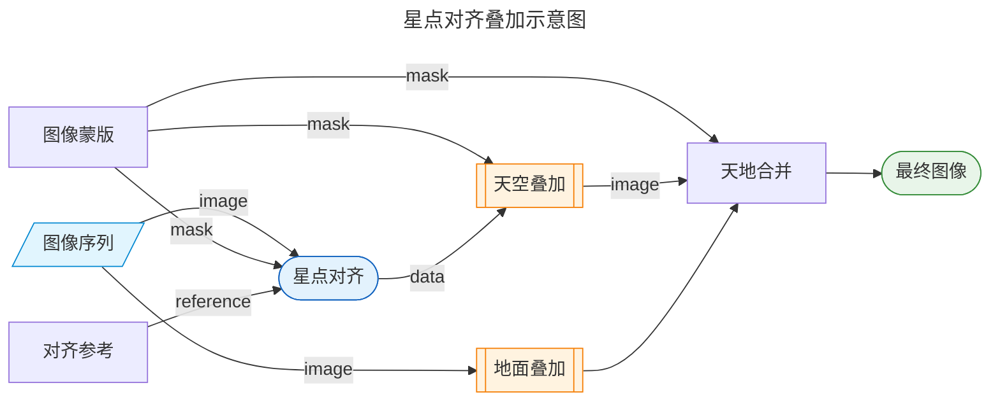

# HoshinoWeaver 用户使用指南

本手册旨在帮助用户理解各模块的功能和参数，并提供从准备素材到输出结果的完整流程指引。

---

## 名词解释

- **工作流**：接受特定输入、产生特定类型输出的计算方式。需要根据你希望得到的产物来选择工作流。例如，"生成星轨"和"堆栈降噪"是不同的工作流，在开始前需要明确选择。

- **模式**：工作流内不同具体计算方式的选项。为达到同一工作流的结果，可能存在多种不同的处理模式。不同模式下可选的参数选项及产出效果可能存在差异。例如，星轨叠加中有"最大值叠加"和"噪声均匀化"两种模式。

- **参数选项**：确定工作流和模式之后，用户将被提供一系列详细的可选参数，用于控制某个功能是否启用、具体的运行参数，以及某些结果是否参与最终输出。

> [!TIP]
> 在图形界面的工作流，模式和参数选项标题上悬浮，会显示相关的说明文本和推荐选项。

---

## 快速上手

### 第一步：确定你想要的结果，选择工作流

| 我想要… | 使用工作流 |
|---|---|
| 将多张图像合成一张星轨照片 | [星轨叠加](#星轨叠加) |
| 多张图像叠加降噪（模拟慢门、流云、流水等） | [堆栈降噪](#堆栈降噪) |
| 将多张图像合成为一张天空按星点对齐降噪，且地景不会因对齐旋转而模糊的星空照片 | [星点对齐叠加](#星点对齐叠加) |

> [!NOTE]
> 启动时默认工作流为“星轨叠加”。如果需要切换，请单击软件顶部的工作流名称，在下拉框中选择希望使用的工作流。

### 第二步：导入图像文件

在"图像文件"输入区域选择全部待处理的图像。支持格式：`.tif`、`.tiff`、`.fits`、`.png`、`.jpg`，以及 `.cr2`、`.nef`、`.arw` 等常见 RAW 格式。

### 第三步：（按需）准备遮罩文件

部分功能需要提供**遮罩**图像，即一张与原始图像尺寸相同、**白色代表天空区域、黑色代表地面区域**的图像。可以用任意绘图软件绘制（如 Photoshop、GIMP），粗略圈出天空和地面的分界线即可，无需精细抠图。详见[附录 C：遮罩文件制作说明](#附录-c遮罩文件制作说明)。

以下功能需要遮罩：
- 星轨叠加 → 去卫星线（地景明亮或较为复杂时可选）
- 星轨叠加 → 噪声均匀化模式（可选，可用于和平均值叠加地景融合）
- 星点对齐叠加 → 叠加地面（可选，启用时天空和地面将会分别处理，避免相互影响）

### 第四步：选择模式和参数

参考各工作流章节选择合适的模式和参数。对于初次使用，保持默认参数通常能获得不错的结果。

### 第五步：设置输出，执行

在输出设置区域选择输出路径和文件格式，然后点击执行。

---

## 工作流

目前 HoshinoWeaver 提供三个主要工作流：

1. **[星轨叠加](#星轨叠加)**：将多张图像合成单张星轨照片。
2. **[堆栈降噪](#堆栈降噪)**：多张图像叠加求统计值，不进行星点对齐（可用于模拟慢门、流云、平滑水面等）。
3. **[星点对齐叠加](#星点对齐叠加)**：带星点对齐的叠加，可分别处理天空和地面区域，产出高信噪比的星空图像。

---

## 星轨叠加

将多张连续拍摄的图像合成为一张包含完整星轨的照片。

### 模式选择

星轨叠加支持两种模式：

#### 最大值叠加

逐像素取所有帧中的最大值。计算简单，速度极快。

**适合以下情况**：
- 素材 ISO 较低，画面噪声较少
- 图像未经过镜头畸变校正
- 地景干净，无明显亮度波动

#### 噪声均匀化

在最大值叠加的基础上，引入均匀化校正算法，消除因镜头校正引入的空间亮度不均和高频纹理伪影，并可选择将背景亮度还原至均值叠加水平。

**适合以下情况**：
- 素材已在前期或其他软件中应用了镜头畸变校正（暗角补偿、畸变矫正）
- 叠加后出现边角偏亮或环状纹理伪影
- 地景受到短时的光照影响，需要排除噪声
- 希望输出结果和平均值地景图像亮度匹配，方便融合

> 关于算法原理，详见[附录 B：噪声均匀化原理](#附录-b噪声均匀化原理)。

---

### 参数说明

#### 星轨效果

**渐入/渐出**

创建星轨双端渐隐效果（类似Photoshop"半岛雪人"插件），使星轨首尾自然淡入淡出。通过双端滑条控制，左端设置渐入比例，右端设置渐出比例。

例如，左右分别设置为 0.2 和 0.7，则：
- 前 20%：渐入
- 20%–70%：完整星轨
- 末 30%：渐出

设置为 0 和 1.0（默认）时，不产生渐隐效果。

---

#### 预处理

**缩星**

在叠加前，对每张图像应用缩星处理，缩小图像中的星点。

适合使用大光圈、高感光度拍摄的序列，或星点过于密集时，可通过缩星使输出的星轨线条更纤细，密度降低，不过于拥挤。

**去卫星线**

在叠加过程中自动检测并去除图像中的卫星轨迹、飞机轨迹等线型干扰。算法通过对比相邻若干帧（帧数通过"去卫星窗口大小"配置）来识别和排除干扰。

- **去卫星窗口大小**：检测窗口的帧数范围。值越大，去除越彻底，但会增加计算时间。推荐设置为 3；仅对特别密集的航线，可适当增大。该选项仅在启用"去卫星线"时显示。

**天空区域遮罩**（顶层）

提供仅标注天空区域的遮罩图像。如使用去卫星线功能，则强烈推荐绘制天空区域遮罩：这将避免地面亮光源干扰星点检测，以及去卫星线功能影响地面画质。天空区域遮罩可以不用非常精细，天地交接部分可以适当用黑色多覆盖一些。

---

#### 噪声均匀化参数

以下参数仅在选择"噪声均匀化"模式时显示。

**暗像素排异阈值 (σ)** 和 **亮像素排异阈值 (σ)**

算法在估算背景噪声时使用 Sigma 裁剪剔除异常像素。这两个参数分别控制剔除偏暗和偏亮像素的激进程度，值越小则剔除越多。通常无需修改默认值。参数详解见[附录 A：Sigma 裁剪参数说明](#附录-asigma-裁剪参数说明)。

**最大迭代次数**

Sigma 裁剪的最大迭代轮数。通常无需修改。参数详解见[附录 A：Sigma 裁剪参数说明](#附录-asigma-裁剪参数说明)。

**天空区域遮罩**（噪声均匀化，可选）

此处的遮罩用于天地融合：启用后，输出图像中天空区域使用星轨叠加结果，地面区域使用 Sigma 裁剪均值结果融合，可同时得到清晰星轨和低噪声地景。

**还原均值亮度**

开启后，算法将背景亮度降至均值叠加水平，使星轨的对比度更突出，与单独拍摄的平均值地景图像亮度匹配，方便后期融合。关闭则仅消除空间不均匀性，保留最大值叠加的整体亮度特性。

---

## 堆栈降噪

将多张图像叠加，通过统计方法降低噪声，不进行星点对齐。适合模拟慢门（流云、流水、平滑海面）、拍摄固定场景的降噪叠加等用途。

### 算法选择

| 算法 | 适用场景 | 说明 |
|---|---|---|
| **均值** | 干净素材，无异常帧 | 最快最锐利，直接求平均，不排除任何异常值 |
| **Sigma 裁剪** | 有异常帧（车灯、飞机、闪光），张数较多（>10 张） | 多轮迭代剔除异常像素后求平均，结果更干净 |
| **中位数** | 有异常帧，张数偏少（<10 张） | 逐像素取中位数，天然排除异常值，无需额外参数，但速度较慢 |
| **Huber 均值** | 轻微异常，希望结果平滑 | 自动降低异常像素的权重，无需设定阈值，比 Sigma 裁剪更平滑 |

#### Sigma 裁剪参数

选择 Sigma 裁剪算法时，可配置排异阈值和迭代次数。参数详解见[附录 A：Sigma 裁剪参数说明](#附录-asigma-裁剪参数说明)。

#### Huber 均值参数

**Huber 常数 c**：控制对异常像素的权重接受程度。值越小，异常像素被压制得越彻底；值越大，结果越接近普通均值。通常保持默认值即可。

---

## 星点对齐叠加

将多张星空照片按星点对齐叠加为一张星点清晰、噪声极低的图像。算法将所有图像对齐到同一参考帧的星点位置，再分别对天空和地面区域进行叠加，输出高信噪比的星空图像，同时避免地景因旋转产生拖影。

### 准备遮罩文件

遮罩文件用于告知软件哪些区域是天空、哪些区域是地面。无论是否叠加地面，都推荐设置遮罩：即使只叠加天空部分，遮罩也可以确保叠加天空时不会有地面图像影响叠加效果。

遮罩文件要求：
- 与原始图像**尺寸相同**
- 白色（`#ffffff`）区域 = 天空
- 黑色（`#000000`）区域 = 地面
- 文件格式：`.tif`、`.tiff`、`.png`、`.jpg`

关于如何制作遮罩，详见[附录 C：遮罩文件制作说明](#附录-c遮罩文件制作说明)。

### 对齐方式选择

| 对齐方式 | 适用素材 | 说明 |
|---|---|---|
| **自动** | 任意 | 在EXIF有镜头数据的情况下自动启动畸变优化 |
| **透视变换** | 已进行镜头畸变校正的图像 | 速度更快，精度高，但对未校正图像效果差 |
| **畸变优化** | 未进行镜头畸变校正的原始图像 | 可处理畸变，但计算速度较慢 |

>[!TIP]
>目前主要支持线性镜头拍摄的图像。鱼眼镜头仅在拍摄时间接近（不超过10分钟）时效果可用。

**同一相机拍摄**：若所有帧来自同一相机和焦距，开启此选项可加速对齐计算，无精度损失。

**对齐基准帧**（可选）：指定对齐的参考图像。留空则使用序列中的第一张。如果第一张图像星点特别少或构图有误，可手动指定一张星点丰富的图像作为基准。

### 叠加算法选择

**天空叠加算法**和**地面叠加算法**分别配置，互相独立。

天空和地面的特点不同，建议的选择策略：

- **天空**：有卫星/飞机线或其他异常值时，推荐 Sigma 裁剪（>10 张）或中位数（<10 张）；素材干净时使用均值即可。
- **地面**：通常使用均值即可；若地景中有车辆通行、人影等干扰，推荐 Sigma 裁剪或中位数。

各算法的详细说明与选择依据同[堆栈降噪 → 算法选择](#算法选择)。

### 是否叠加地面

**叠加地面**开关：
- **开启**：天空和地面分别叠加后融合，输出完整画面。
- **关闭**：仅叠加天空部分；如果配置了遮罩，地面区域将为黑色；如果未配置遮罩，地面会因星点旋转对齐而产生拖影。

---

## 附录

### 附录 A：Sigma 裁剪参数说明

Sigma 裁剪（Sigma Clipping）是一种迭代异常值剔除算法：每轮计算当前像素集合的均值和标准差，剔除偏离均值超过设定倍数（sigma 值）的像素，重复直到没有新的像素被剔除或达到最大迭代次数。

**亮像素排异阈值 (σ)**：高于均值多少个标准差视为偏亮异常像素并排除。值越小，排除越激进。推荐范围 2.5–3.5；降低到 2.0 以下可能误排正常像素。

**暗像素排异阈值 (σ)**：低于均值多少个标准差视为偏暗异常像素并排除。通常与亮像素阈值保持一致。推荐范围 2.5–3.5。

**最大迭代次数**：算法最多执行多少轮迭代。大多数情况下 3–5 次迭代已收敛，无需增加。增大此值会略微增加计算时间。

> Sigma 裁剪适合帧数较多（>20 张）的情况。帧数偏少时，可改用中位数，无需配置阈值参数。

---

### 附录 B：噪声均匀化原理

本节为对算法原理感兴趣的用户提供简要说明，不影响软件的正常使用。

#### 问题来源

星轨叠加通常使用"最大值叠加"：对每个像素取所有帧中的最大值，星星经过的区域因此会留下完整轨迹。

然而，当输入图像已经过**镜头畸变校正**（包括暗角补偿和畸变矫正），画面不同位置的噪声方差会变得不均匀：
- 暗角补偿会放大边缘区域的噪声
- 畸变矫正的插值操作会引入周期性的噪声方差变化，形成环状纹理

在均值叠加中，这些差异会因统计平均而抵消，肉眼不可见。但最大值叠加会**将噪声的空间不均匀性放大**，导致边角偏亮或出现环状摩尔纹伪影。

#### 解决思路

噪声均匀化的核心思路是：**不消除噪声，只均匀化噪声**。

算法通过 Sigma 裁剪逐像素估算每个位置的噪声标准差，得到一张"噪声方差分布图"，再根据各位置噪声偏高或偏低于全图中位数的程度，对最大值叠加结果做加减校正，将整幅图像的噪声底面拉齐到统一高度。

星星经过的像素（信号远强于噪声）不受影响，只有纯背景区域会被校正。

**"还原均值亮度"选项**：如果同时启用该选项，算法会进一步将背景亮度还原至均值叠加的水平（而非最大值叠加的统计均值），使结果图像更容易和平均值地景图像直接融合。

#### 局限性

- 需要足够多的帧数（推荐 ≥ 50 张）来稳定估算逐像素噪声方差
- 如果拍摄期间天空亮度发生明显变化（如月升月落），噪声估算可能出现偏差
- 仅对已应用镜头校正的素材有明显改善效果；未校正的素材使用"最大值叠加"即可

---

### 附录 C：遮罩文件制作说明

遮罩文件用于告知软件图像中天空和地面的分界，在去卫星线、噪声均匀化地面融合、以及星点对齐叠加工作流中使用。

#### 制作方法

1. 在 Photoshop、GIMP 或其他图像编辑软件中打开任意一张原始图像
2. 新建一个图层，填充为**纯黑色**（`#000000`）
3. 用画笔工具将**天空区域**涂抹为**纯白色**（`#ffffff`）
4. 地平线附近无需完美贴合，留有数十像素的余量即可
5. 保存为 `.tif` 或 `.png` 格式，与原始图像放在同一目录下

#### 注意事项

- 遮罩尺寸最好与原始图像**完全一致**（像素宽高相同）
- 只需制作一张遮罩，软件会自动应用到整个序列
- 遮罩中只需区分天空和地面，不需要精细抠图；粗略的边界通常已足够。
- 天地交接部分可以适当用黑色多覆盖一些。
