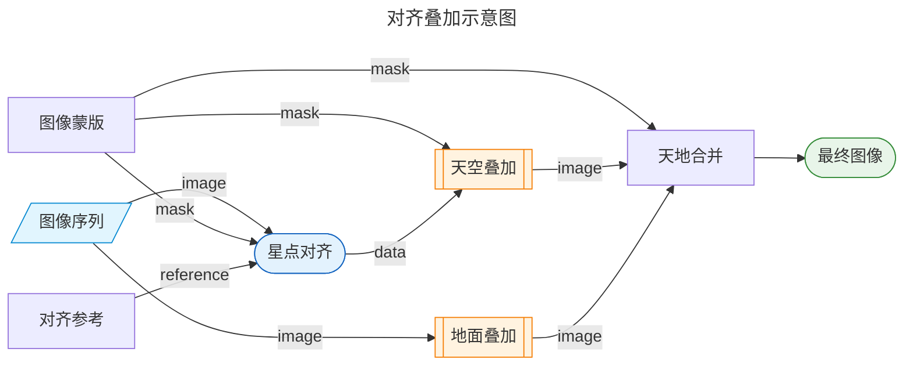

# HoshinoWeaver 用户使用指南

本手册旨在帮助用户理解各模块的功能和参数，并提供从准备素材到输出结果的完整流程指引。

---

## 名词解释

- **工作流**：接受特定输入、产生特定类型输出的计算方式。需要根据你希望得到的产物来选择工作流。例如，"生成星轨"和"堆栈降噪"是不同的工作流，在开始前需要明确选择。

- **模式**：工作流内不同具体计算方式的选项。为达到同一工作流的结果，可能存在多种不同的处理模式。不同模式下可选的参数选项及产出效果可能存在差异。例如，星轨叠加中有"最大值叠加"和"噪声均匀化"两种模式。

- **参数选项**：确定工作流和模式之后，用户将被提供一系列详细的可选参数，用于控制某个功能是否启用、具体的运行参数，以及某些结果是否参与最终输出。

> [!TIP]
> 在图形界面的工作流，模式和参数选项标题上悬浮，会显示相关的说明文本和推荐选项。

---

## 快速上手

### 第一步：确定你想要的结果，选择工作流

| 我想要… | 使用工作流 |
|---|---|
| 将多张图像合成一张星轨照片 | [星轨叠加](#星轨叠加) |
| 多张图像叠加降噪（模拟慢门、流云、流水等） | [堆栈降噪](#堆栈降噪) |
| 将多张图像合成为一张天空按星点对齐降噪，且地景不会因对齐旋转而模糊的星空照片 | [对齐叠加](#对齐叠加) |
| 生成星轨随时间变化、带拖尾或渐隐效果的图像序列 | [星轨延时](#星轨延时) |
| 对延时星空逐帧对齐降噪，保留星空随时间变化的运动 | [延时降噪](#延时降噪) |

> [!NOTE]
> 启动时默认工作流为“星轨叠加”。如果需要切换，请单击软件顶部的工作流名称，在下拉框中选择希望使用的工作流。

### 第二步：导入图像文件

在"图像文件"输入区域选择全部待处理的图像。支持格式包括 `.tif`、`.tiff`、`.fits`、`.png`、`.jpg`、`.jpeg`，以及 `.cr2`、`.cr3`、`.nef`、`.arw`、`.dng`、`.rw2`、`.orf`、`.raf` 等常见 RAW 格式，以及 `.fts` 等天文数据格式。

对于渐入渐出、去卫星线和延时工作流，应确保输入序列按拍摄先后排列。联合对齐和延时降噪应使用同一相机、同一镜头及焦距拍摄的序列。

### 第三步：（按需）准备遮罩文件

部分功能需要提供**遮罩**图像，即一张与原始图像尺寸相同、**白色代表天空区域、黑色代表地面区域**的图像。可以用任意绘图软件绘制（如 Photoshop、GIMP），粗略圈出天空和地面的分界线即可，无需精细抠图。详见[附录 C：遮罩文件制作说明](#附录-c遮罩文件制作说明)。

以下功能会使用遮罩：
- 星轨叠加 → 去卫星线（地景明亮或较为复杂时可选）
- 星轨叠加 → 噪声均匀化模式（可选，可用于和平均值叠加地景融合）
- 对齐叠加 → 叠加地面（天地分离时需提供；仅处理天空时也推荐使用）
- 星轨延时 → 去卫星线（可选，用于限定星点检测区域）
- 延时降噪 → 启用地景窗口（天地分离时需提供；仅处理天空时也推荐使用）

### 第四步：选择模式和参数

参考各工作流章节选择合适的模式和参数。对于初次使用，保持默认参数通常能获得不错的结果。

### 第五步：设置输出，执行

在输出设置区域选择输出路径和文件格式，然后点击执行。

- **单张图像工作流**：指定输出文件名；JPG 支持 8 位，PNG 支持 8/16 位，TIFF 支持 8/16/32 位。
- **星轨延时、延时降噪**：指定输出目录和文件名模板，保存逐帧图像。详见[序列输出设置](#序列输出设置)。

启动前会检查配置合法性并估算资源需求；如果提示配置有误，先修正对应选项。运行中也可以随时点击停止按钮中止任务。

---

## 工作流

目前 HoshinoWeaver 提供五个主要工作流：

1. **[星轨叠加](#星轨叠加)**：将多张图像合成单张星轨照片。
2. **[堆栈降噪](#堆栈降噪)**：多张图像叠加求统计值，不进行星点对齐（可用于模拟慢门、流云、平滑水面等）。
3. **[对齐叠加](#对齐叠加)**：带星点对齐的叠加，可分别处理天空和地面区域，产出高信噪比的星空图像。
4. **[星轨延时](#星轨延时)**：按滑动窗口或指数衰减生成逐帧星轨图像序列。
5. **[延时降噪](#延时降噪)**：联合求解序列的对齐关系，以每个窗口中心帧为参考叠加降噪，输出延时图像序列。

---

## 星轨叠加

将多张连续拍摄的图像合成为一张包含完整星轨的照片。

### 模式选择

星轨叠加支持两种模式：

#### 最大值叠加

逐像素取所有帧中的最大值。计算简单，速度极快。

**适合以下情况**：
- 素材 ISO 较低，画面噪声较少
- 图像未经过镜头畸变校正
- 地景干净，无明显亮度波动

#### 噪声均匀化

在最大值叠加的基础上，引入均匀化校正算法，消除因镜头校正引入的空间亮度不均和高频纹理伪影，并可选择将背景亮度还原至均值叠加水平。

**适合以下情况**：
- 素材已在前期或其他软件中应用了镜头畸变校正（暗角补偿、畸变矫正）
- 叠加后出现边角偏亮或环状纹理伪影
- 地景受到短时的光照影响，需要排除噪声
- 希望输出结果和平均值地景图像亮度匹配，方便融合

> 关于算法原理，详见[附录 B：噪声均匀化原理](#附录-b噪声均匀化原理)。

---

### 参数说明

#### 星轨效果

**渐入/渐出**

创建星轨双端渐隐效果（类似Photoshop"半岛雪人"插件），使星轨首尾自然淡入淡出。通过双端滑条控制，左端设置渐入比例，右端设置渐出比例。

例如，左右分别设置为 0.2 和 0.7，则：
- 前 20%：渐入
- 20%–70%：完整星轨
- 末 30%：渐出

设置为 0 和 1.0（默认）时，不产生渐隐效果。

---

#### 预处理

**缩星**

在叠加前，对每张图像应用缩星处理，缩小图像中的星点。

启用后可选择**缩星力度**：轻度、适中、较强、强力、去星，默认“适中”。力度越高，星点被压制得越明显；“去星”适用于希望显著去除星点的效果，不适合作为保留完整星轨时的常规选择。

适合使用大光圈、高感光度拍摄的序列，或星点过于密集时，可通过缩星使输出的星轨线条更纤细，密度降低，不过于拥挤。

**去卫星线**

在叠加过程中自动检测并去除图像中的卫星轨迹、飞机轨迹等线型干扰。算法通过对比相邻若干帧（帧数通过"去卫星窗口大小"配置）来识别和排除干扰。

- **去卫星窗口大小**：检测窗口的帧数范围。值越大，去除越彻底，但会增加计算时间。推荐设置为 3；仅对特别密集的航线，可适当增大。该选项仅在启用"去卫星线"时显示。

**焦距信息**（去卫星线）

默认选择“读取 EXIF”，去卫星线会使用每一帧的 EXIF 焦距信息来估计旋转；EXIF 缺失或不完整时，程序使用 20mm 等效焦距作为兜底值。

选择“手动指定”后，界面会显示**镜头焦距（mm）**和**传感器裁切系数**。焦距应填写实际焦距；全画幅裁切系数为 1.0，35mm 等效焦距 = 实际焦距 × 裁切系数。手动模式会忽略输入图像中的 EXIF 焦距。

**天空区域遮罩**（顶层）

提供仅标注天空区域的遮罩图像。如使用去卫星线功能，则强烈推荐绘制天空区域遮罩：这将避免地面亮光源干扰星点检测，以及去卫星线功能影响地面画质。天空区域遮罩可以不用非常精细，天地交接部分可以适当用黑色多覆盖一些。

---

#### 噪声均匀化参数

以下参数仅在选择"噪声均匀化"模式时显示。

**暗像素排异阈值 (σ)** 和 **亮像素排异阈值 (σ)**

算法在估算背景噪声时使用 Sigma 裁剪剔除异常像素。这两个参数分别控制剔除偏暗和偏亮像素的激进程度，值越小则剔除越多。通常无需修改默认值。参数详解见[附录 A：Sigma 裁剪参数说明](#附录-asigma-裁剪参数说明)。

**最大迭代次数**

Sigma 裁剪的最大迭代轮数。通常无需修改。参数详解见[附录 A：Sigma 裁剪参数说明](#附录-asigma-裁剪参数说明)。

**天空区域遮罩**（噪声均匀化，可选）

此处的遮罩用于天地融合：启用后，输出图像中天空区域使用星轨叠加结果，地面区域使用 Sigma 裁剪均值结果融合，可同时得到清晰星轨和低噪声地景。

**还原均值亮度**

开启后，算法将背景亮度降至均值叠加水平，使星轨的对比度更突出，与单独拍摄的平均值地景图像亮度匹配，方便后期融合。关闭则仅消除空间不均匀性，保留最大值叠加的整体亮度特性。

---

## 堆栈降噪

将多张图像叠加，通过统计方法降低噪声，不进行星点对齐。适合模拟慢门（流云、流水、平滑海面）、拍摄固定场景的降噪叠加等用途。

### 算法选择

| 算法 | 适用场景 | 说明 |
|---|---|---|
| **均值** | 干净素材，无异常帧 | 最快最锐利，直接求平均，不排除任何异常值 |
| **Sigma 裁剪** | 有异常帧（车灯、飞机、闪光），张数较多（>10 张） | 多轮迭代剔除异常像素后求平均，结果更干净 |
| **中位数** | 有异常帧，张数偏少（<10 张） | 逐像素取中位数，天然排除异常值，无需额外参数，但速度较慢 |
| **Huber 均值** | 轻微异常，希望结果平滑 | 自动降低异常像素的权重，通过 Huber 常数 c 控制压制程度 |

#### Sigma 裁剪参数

选择 Sigma 裁剪算法时，可配置排异阈值和迭代次数。参数详解见[附录 A：Sigma 裁剪参数说明](#附录-asigma-裁剪参数说明)。

#### Huber 均值参数

**Huber 常数 c**：控制对异常像素的权重接受程度。值越小，异常像素被压制得越彻底；值越大，结果越接近普通均值。通常保持默认值即可。

---

## 对齐叠加

将多张星空照片按星点对齐叠加为一张星点清晰、噪声极低的图像。算法将所有图像对齐到同一参考帧的星点位置，再分别对天空和地面区域进行叠加，输出高信噪比的星空图像，同时避免地景因旋转产生拖影。

```mermaid
---
title: 对齐叠加示意图
---
flowchart LR

    %% Global Inputs
    图像序列[/"图像序列"/]
    class 图像序列 inputNode

    %% Nodes
    对齐参考["对齐参考"]
    星点对齐(["星点对齐"])
    class 星点对齐 mapNode
    天空叠加[["天空叠加"]]
    class 天空叠加 subDagNode
    地面叠加[["地面叠加"]]
    class 地面叠加 subDagNode
    天地合并["天地合并"]

    %% Global Outputs
    最终图像(["最终图像"])
    class 最终图像 outputNode

    %% Edges
    图像序列 -->|"image"| 星点对齐
    图像蒙版 -->|"mask"| 星点对齐
    图像蒙版 -->|"mask"| 天空叠加
    图像序列 -->|"image"| 地面叠加
    对齐参考 -->|"reference"| 星点对齐
    星点对齐 -->|"data"| 天空叠加
    图像蒙版 -->|"mask"| 天地合并
    天空叠加 -->|"image"| 天地合并
    地面叠加 -->|"image"| 天地合并
    天地合并 --> 最终图像

    %% Styles
    classDef inputNode fill:#e1f5fe,stroke:#0288d1
    classDef outputNode fill:#e8f5e9,stroke:#388e3c
    classDef subDagNode fill:#fff3e0,stroke:#f57c00
    classDef routeNode fill:#f3e5f5,stroke:#7b1fa2
    classDef mapNode fill:#e3f2fd,stroke:#1565c0
    classDef reduceNode fill:#fce4ec,stroke:#c62828
    classDef sinkNode fill:#efebe9,stroke:#4e342e
```

### 准备遮罩文件

遮罩文件用于告知软件哪些区域是天空、哪些区域是地面。无论是否叠加地面，都推荐设置遮罩：即使只叠加天空部分，遮罩也可以确保叠加天空时不会有地面图像影响叠加效果。

遮罩文件要求：
- 与原始图像**尺寸相同**
- 白色（`#ffffff`）区域 = 天空
- 黑色（`#000000`）区域 = 地面
- 文件格式：`.tif`、`.tiff`、`.png`、`.jpg`

关于如何制作遮罩，详见[附录 C：遮罩文件制作说明](#附录-c遮罩文件制作说明)。

### 对齐方式选择

在工作流下拉框中选择“对齐叠加”，再选择以下对齐方式。当前默认使用**联合对齐**。

| 对齐方式 | 适用素材 | 参考帧与特点 |
|---|---|---|
| **直接对齐** | 需要对齐到序列外的参考图，或输入图像来自不同的相机/镜头 | 每帧独立对齐到指定的“对齐基准帧”，泛用性好，速度较快；参考图可来自序列外部 |
| **联合对齐** | 使用同一相机、同一镜头及焦距拍摄的序列 | 共享相机参数，联合优化各帧指向，准确度与一致性更好；参考帧必须来自输入序列 |

#### 直接对齐

先指定一张星点清晰、与输入图像有足够重叠的**对齐基准帧**，再选择具体的对齐方式：

| 对齐方式 | 适用素材 | 说明 |
|---|---|---|
| **透视变换** | 已进行镜头畸变校正的图像 | 默认选项，计算较快；不适合明显未校正畸变的图像 |
| **畸变校正** | 未校正畸变的标准镜头或鱼眼图像 | 构建相机模型，同时优化镜头焦距和畸变；应提供可靠的 EXIF 或手动相机信息作为初始参考值 |

选择“畸变校正”后，**相机信息**可设为：

- **读取 EXIF**：从照片中读取相机和镜头信息。
- **指定同一相机**：用于 EXIF 不完整的同相机素材，选择镜头类型并填写实际焦距、传感器裁切系数。
- **指定不同相机**：用于 EXIF 不完整的不同相机素材，可分别指定参考帧和输入帧的镜头类型，支持标准镜头与鱼眼之间的对齐；应保留各自的 EXIF 信息。

#### 联合对齐

联合对齐使用多帧 Bundle Adjustment（BA）算法，利用整段序列的星点匹配共同求解相机参数和每帧指向。

- **参考帧序号**：从 0 开始计数，例如 0 为第一张。未指定时使用序列中间帧。
- **联合优化焦距**：默认开启，利用全序列匹配优化共享焦距。
- **联合优化畸变**：默认开启，利用全序列匹配优化共享畸变。

#### 镜头信息与中心偏移

**镜头类型**与[直接对齐](#直接对齐)中可配置的**相机信息**一致。

**中心偏移**：对于已知进行过裁切或镜头光心偏心的图像，可开启该选项，改善求解相机模型的准确度。

> [!TIP]
> 当前已支持标准镜头和鱼眼镜头。大畸变边缘、星点稀少或图像间重叠较低时仍可能对齐不佳；优先使用星点清晰、重叠充分的素材，必要时提供天空遮罩，排除地面亮光源的干扰。

### 叠加算法选择

**天空叠加算法**和**地面叠加算法**分别配置，互相独立。

天空和地面的特点不同，建议的选择策略：

- **天空**：有卫星/飞机线或其他异常值时，推荐 Sigma 裁剪（>10 张）或中位数（<10 张）；素材干净时使用均值即可。
- **地面**：通常使用均值即可；若地景中有车辆通行、人影等干扰，推荐 Sigma 裁剪或中位数。

均值、Sigma 裁剪、中位数和 Huber 均值的详细说明与选择依据同[堆栈降噪 → 算法选择](#算法选择)。

此外，天空和地面均可选择**最大值**或**最大值混合**：前者逐像素保留最亮值，后者在最大值基础上校正空间亮度不均。这两种算法可用于保留飞机、卫星等明亮轨迹，不适合去除这些干扰。

### 是否叠加地面

**叠加地面**开关：
- **开启**：配合天空遮罩，天空按对齐叠加，地面不做几何变换而单独叠加，最后融合为完整画面。要实现天地分离，请同时提供遮罩。
- **关闭**：仅叠加天空部分；如果配置了遮罩，地面区域将为黑色；如果未配置遮罩，地面会因星点旋转对齐而产生拖影。

---

## 星轨延时

将连续拍摄的图像处理为逐帧星轨序列，用于制作星轨延时动画。输入帧按时间顺序参与处理，星轨随窗口移动或亮度衰减而变化。

### 延时模式

| 模式 | 效果 | 主要参数 |
|---|---|---|
| **滑窗最大值** | 对当前帧及之前若干帧逐像素取最大值，窗口外的旧轨迹直接退出 | 窗口大小 |
| **指数衰减** | 旧轨迹逐帧变暗，与当前帧取最大值，形成平滑渐隐的彗星尾效果 | 半衰期 |
| **渐入渐出** | 对滑窗内图像按渐入渐出权重取最大值，控制轨迹两端的淡化 | 窗口大小、渐入/渐出 |

**窗口大小**：每张输出最多使用多少张输入图像，默认 30 帧，界面范围为 1–300 帧。值越大，星轨通常越长。滑窗模式在序列开头不足一个窗口时，使用已有帧输出，因此开头的星轨会逐渐增长。

**半衰期**：仅用于指数衰减，表示旧轨迹的贡献衰减到一半所需的帧数，默认 30 帧，界面范围为 1–300 帧。值越大，旧轨迹保留越久；它没有固定的窗口截断边界。

**渐入/渐出**：仅用于“渐入渐出”模式，滑条含义同[星轨效果](#星轨效果)，但比例作用于每个滑动窗口，而不是整段输入序列。该模式每帧都需处理窗口内的加权图像，通常比前两种模式慢。

### 预处理与输出

可启用**缩星**并选择力度，也可启用**去卫星线**、选择焦距信息来源、设置去卫星窗口大小及天空区域遮罩，用法同[星轨叠加的预处理](#预处理)。此处遮罩仅用于去卫星线的星点检测，不提供独立的地景降噪融合。

在“输出序列”区域指定目录，保存方式见[序列输出设置](#序列输出设置)。

---

## 延时降噪

将同一相机、同一镜头及焦距拍摄的延时序列逐帧降噪。软件先用联合对齐求解全序列，再将每个窗口内的天空对齐到**该窗口中心帧**后叠加。因此输出保留星空随时间变化的位置。

### 相机与联合优化

镜头类型、实际焦距、传感器裁切系数、联合优化焦距、联合优化畸变及中心偏移的含义同[对齐叠加](#对齐叠加)。EXIF 完整时可使用自动读取；缺失时应手动补齐相机信息。

### 天空与地景窗口

- **星空窗口大小**：以当前输出对应的中心帧为中心，取前后邻近帧进行对齐叠加。默认 5 帧；序列两端会自动缩小窗口。
- **启用地景窗口**：配合“天空/地景蒙版”，对黑色区域使用未做几何变换的地景叠加结果，与白色区域的天空结果融合。未提供蒙版时输出天空对齐结果，无法实现天地分离。
- **地景窗口大小**：独立控制地景叠加帧数，默认 5 帧。可设为 1，以保留当前帧的地景；增大窗口可平滑地景变化，也可能使运动物体模糊。

两个窗口大小均要求正奇数，界面范围为 1–31 帧。当前天空默认至少需要 2 张有效对齐帧，因此星空窗口应从 3 帧起选；虽然界面允许设为 1，但该值不满足默认的最少贡献帧数要求。

例如，星空窗口设为 5、地景窗口设为 1，并启用地景窗口、提供蒙版，可在用邻近帧降低天空噪声的同时保留当前时刻的地景。

**星空叠加算法**与**地景叠加算法**可分别选择均值、最大值、中位数或 Sigma 裁剪。干净素材可使用均值；有飞机线等干扰时，小窗口可使用中位数，较大窗口可使用 Sigma 裁剪。最大值会保留明亮轨迹。Sigma 裁剪参数的含义见[附录 A](#附录-asigma-裁剪参数说明)。

### 后处理与输出

可在窗口叠加后启用**缩星**并选择缩星力度。输出为图像序列，保存方式见下一节。

若中心帧未成功对齐，或窗口内有效帧数不足，对应输出帧会被跳过，输出张数可能少于输入张数。完成后应检查处理报告和输出序列，尤其是序列两端及星点较少的片段。

---

## 序列输出设置

星轨延时和延时降噪均通过“输出序列”区域配置：

- **输出目录**：逐帧图像的保存位置。
- **图像格式与位深**：PNG、TIFF 支持 8/16 位；JPG 为 8 位。需要继续后期处理时，可选择 16 位 PNG 或 TIFF。
- **文件名模板**：使用 `{index}` 表示从 0 开始的输出序号。例如，`frame_{index:05d}.png` 会生成 `frame_00000.png`、`frame_00001.png` 等文件。模板不含占位符时，程序自动在扩展名前加入序号。自定义模板的扩展名应与所选格式一致。

延时降噪还支持用 `{frame_index}` 保留对应的原始中心帧序号，例如 `frame_{frame_index:05d}.tif`；有帧被跳过时，文件序号会保留空缺，便于定位原素材。星轨延时使用 `{index}`。

---

## 附录

### 附录 A：Sigma 裁剪参数说明

Sigma 裁剪（Sigma Clipping）是一种迭代异常值剔除算法：每轮计算当前像素集合的均值和标准差，剔除偏离均值超过设定倍数（sigma 值）的像素，重复直到没有新的像素被剔除或达到最大迭代次数。

**亮像素排异阈值 (σ)**：高于均值多少个标准差视为偏亮异常像素并排除。值越小，排除越激进。推荐范围 2.5–3.5；降低到 2.0 以下可能误排正常像素。

**暗像素排异阈值 (σ)**：低于均值多少个标准差视为偏暗异常像素并排除。通常与亮像素阈值保持一致。推荐范围 2.5–3.5。

**最大迭代次数**：算法最多执行多少轮迭代。大多数情况下 3–5 次迭代已收敛，无需增加。增大此值会略微增加计算时间。

> Sigma 裁剪适合帧数较多（>20 张）的情况。帧数偏少时，可改用中位数，无需配置阈值参数。

---

### 附录 B：噪声均匀化原理

本节为对算法原理感兴趣的用户提供简要说明，不影响软件的正常使用。

#### 问题来源

星轨叠加通常使用"最大值叠加"：对每个像素取所有帧中的最大值，星星经过的区域因此会留下完整轨迹。

然而，当输入图像已经过**镜头畸变校正**（包括暗角补偿和畸变矫正），画面不同位置的噪声方差会变得不均匀：
- 暗角补偿会放大边缘区域的噪声
- 畸变矫正的插值操作会引入周期性的噪声方差变化，形成环状纹理

在均值叠加中，这些差异会因统计平均而抵消，肉眼不可见。但最大值叠加会**将噪声的空间不均匀性放大**，导致边角偏亮或出现环状摩尔纹伪影。

#### 解决思路

噪声均匀化的核心思路是：**不消除噪声，只均匀化噪声**。

算法通过 Sigma 裁剪逐像素估算每个位置的噪声标准差，得到一张"噪声方差分布图"，再根据各位置噪声偏高或偏低于全图中位数的程度，对最大值叠加结果做加减校正，将整幅图像的噪声底面拉齐到统一高度。

星星经过的像素（信号远强于噪声）不受影响，只有纯背景区域会被校正。

**"还原均值亮度"选项**：如果同时启用该选项，算法会进一步将背景亮度还原至均值叠加的水平（而非最大值叠加的统计均值），使结果图像更容易和平均值地景图像直接融合。

#### 局限性

- 需要足够多的帧数（推荐 ≥ 50 张）来稳定估算逐像素噪声方差
- 如果拍摄期间天空亮度发生明显变化（如月升月落），噪声估算可能出现偏差
- 仅对已应用镜头校正的素材有明显改善效果；未校正的素材使用"最大值叠加"即可

---

### 附录 C：遮罩文件制作说明

遮罩文件用于告知软件图像中天空和地面的分界，在去卫星线（含星轨延时）、噪声均匀化地面融合、对齐叠加以及延时降噪工作流中使用。

#### 制作方法

1. 在 Photoshop、GIMP 或其他图像编辑软件中打开任意一张原始图像
2. 新建一个图层，填充为**纯黑色**（`#000000`）
3. 用画笔工具将**天空区域**涂抹为**纯白色**（`#ffffff`）
4. 地平线附近无需完美贴合，留有数十像素的余量即可
5. 保存为 `.tif` 或 `.png` 格式，与原始图像放在同一目录下

#### 注意事项

- 遮罩尺寸应与原始图像**完全一致**（像素宽高相同）
- 地平线位置固定的序列只需制作一张遮罩，软件会应用到整个序列；暂时不支持动态序列的遮罩
- 遮罩中只需区分天空和地面，不需要精细抠图；粗略的边界通常已足够。
- 天地交接部分可以适当用黑色多覆盖一些。
